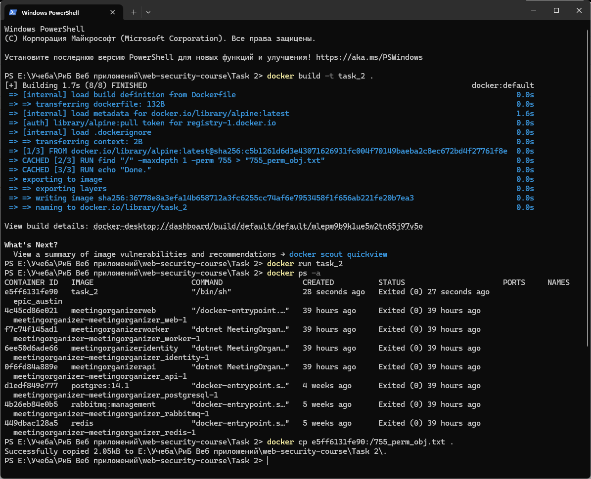

Лабораторная работа №2. Используя Docker, запустить скрипт из лабораторной работы №1:
Вывести в текстовый файл все объекты корневой директории, удовлетворяющие правам доступа 755.

Результат работы: 